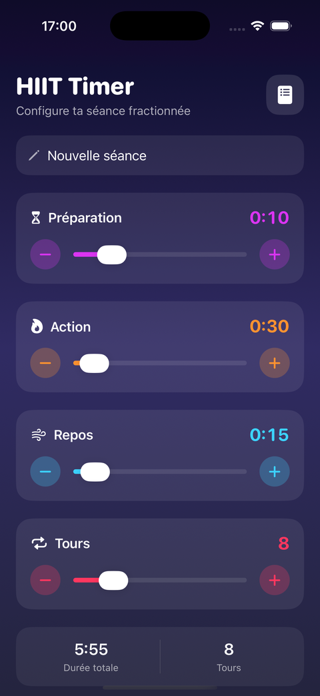
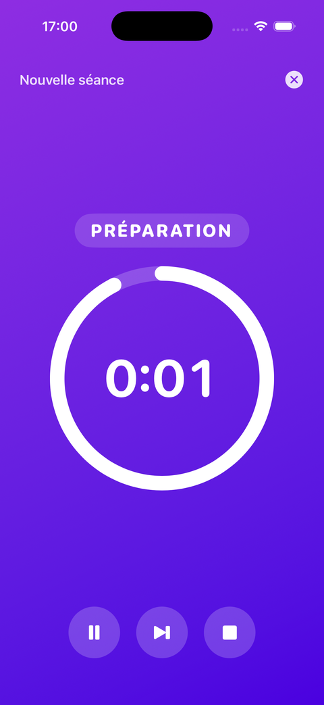
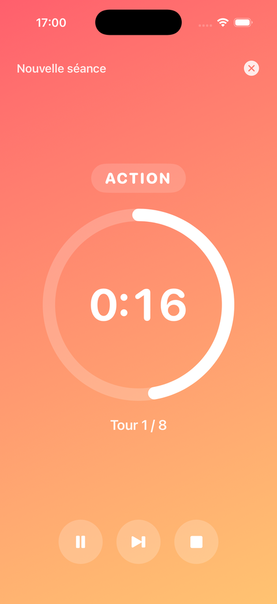
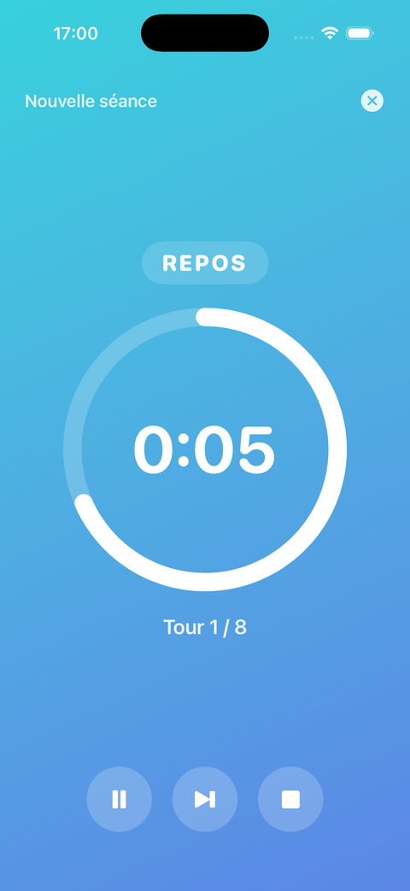
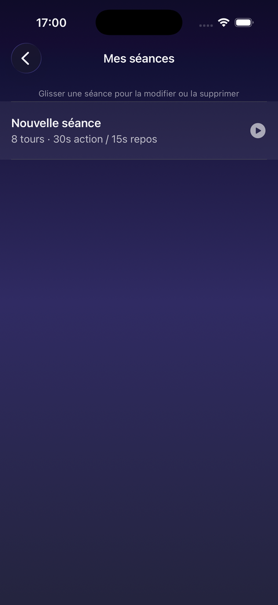

# HIIT Timer


Une application iOS de chronométrage HIIT (entraînement fractionné), conçue sur mesure pour un usage personnel — écrite de bout en bout avec l'aide de [Claude Code](https://claude.com/claude-code).

## Pourquoi ce projet

Ce repo n'est pas qu'un chrono de sport : c'est une démonstration concrète de ce que permet le développement assisté par IA aujourd'hui.

Pas de compétences iOS préalables, pas d'app générique téléchargée sur l'App Store qui approche le besoin sans jamais vraiment le combler — juste une conversation en langage naturel (*"je veux régler mon temps d'action, mon temps de repos, le nombre de tours, et pouvoir sauvegarder mes séances"*) transformée en une vraie application native SwiftUI, buildable et installable sur son propre iPhone.

**L'idée à retenir : quand se faire développer une app sur mesure ne coûte (presque) que le temps de la décrire, pourquoi se contenter d'une app générique qui ne correspond jamais tout à fait à son besoin ?**

## Fonctionnalités

- Réglage du temps d'action, du temps de repos, du temps de préparation et du nombre de tours
- Sauvegarde, modification et suppression de séances réutilisables
- Chrono plein écran avec anneau de progression animé et couleur de fond qui change selon la phase
- Signaux sonores synthétisés à la volée (aucun fichier audio embarqué) : début de séance, début de chaque phase, décompte des 3 dernières secondes, fin de séance
- Le chrono continue même écran verrouillé
- Interface 100% SwiftUI, sombre et dynamique, pensée pour rester lisible pendant l'effort

## Aperçu

<table>
<tr>
<td align="center"><br/><sub>Configuration</sub></td>
<td align="center"><br/><sub>Préparation</sub></td>
<td align="center"><br/><sub>Action</sub></td>
<td align="center"><br/><sub>Repos</sub></td>
<td align="center"><br/><sub>Mes séances</sub></td>
</tr>
</table>

## Comment ça marche

1. **Configurer** — sur l'écran d'accueil, on règle temps d'action, temps de repos, temps de préparation et nombre de tours avec des sliders et des boutons +/-. Un résumé affiche la durée totale de la séance.
2. **Démarrer** — le chrono passe en plein écran : la couleur de fond indique la phase en cours (violet = préparation, orange = action, bleu = repos), avec pause, passage à la phase suivante et arrêt.
3. **Sauvegarder** — une séance peut être enregistrée pour être relancée plus tard sans tout reconfigurer, depuis l'écran "Mes séances" (glisser pour modifier ou supprimer).

## Architecture

Projet en SwiftUI + Combine + AVFoundation natifs, sans dépendance externe :

```
Models/    WorkoutSession (donnée), WorkoutPhase (état),
           WorkoutTimerEngine (moteur du chrono), SessionStore (persistence)
Views/     SetupView, TimerView, SessionListView + composants réutilisables
Audio/     SoundManager — sons générés en direct (sinusoïdes AVAudioEngine)
Theme/     Couleurs et dégradés centralisés
```

Le projet Xcode (`HIITTimer.xcodeproj`) est généré à partir de [`project.yml`](project.yml) via [XcodeGen](https://github.com/yonaskolb/XcodeGen), plutôt qu'écrit à la main — plus simple à versionner et à faire évoluer sans risque de corrompre le fichier de projet.

## Intégration continue

Chaque push sur `main` déclenche un build automatique du projet sur un runner macOS ([`.github/workflows/ci.yml`](.github/workflows/ci.yml)), pour repérer immédiatement toute régression de compilation.

## Lancer le projet

```bash
# Si vous modifiez project.yml, régénérez le projet Xcode :
brew install xcodegen
xcodegen generate

# Puis ouvrez le projet
open HIITTimer.xcodeproj
```

Sélectionnez un simulateur (ou votre iPhone, en choisissant votre compte Apple dans Signing & Capabilities) puis lancez avec `Cmd+R`.

## Stack

- Swift 5 / SwiftUI — iOS 17+
- XcodeGen pour la génération du projet
- GitHub Actions pour la CI

---

*Conçue et codée avec [Claude Code](https://claude.com/claude-code).*
